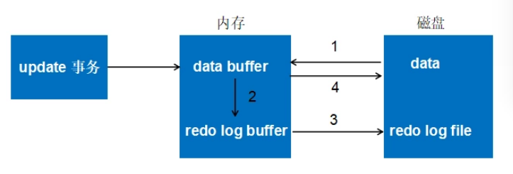

**事务**

本章先抛出事务相关的一些概念，并由此引出ACID特性，以及为实现这些特性所用的技术、机制；接着介绍这些机制包括事务日志、隔离级别、MVCC。当然还有锁机制，其内容比较多，独立成一章。

## 1. 引言

看数据库资料的时候，常常会看到事务、ACID、事务隔离级别、MVCC、锁这样概念，他们之间的关系是什么呢？引出这样几个问题：
>
>* 数据库的事务是什么，经常提到的ACID又是怎么回事？
>* ACID的每个特性是怎么实现的，不同事务隔离级别下，ACID特性实现的怎么样？
>* 事务和锁有什么关系，支持锁就是支持事务么？
>* 事务、ACID、隔离级别、锁等是怎么引申出来的？

## 2. ACID

### 2.1 概念

因为实际的应用场景而提出了事务的概念：你在设计一些任务的时候，需要多条SQL语句，并且希望这些语句要么全都执行，要不都不执行，如果最终结果是只执行了一半，就非常可能出现逻辑上的错误。可认为事务是访问和更新数据库的程序执行单元。

### 2.2 特征

有了基本概念上的认识，就要想想怎么才算事务呢，于是有了ACID特性，即
```
 * Atomicity.原子性: 一个事务的操作是要么全部成功，要么全部失败
 * Consistency.一致性: 事务执行结束后，数据库还是合法状态（就是你认为对的状态）
 * Isolation.隔离性: 一个事务的执行不受其他事务的影响。A、D侧重事务本身，I侧重事务之间
 * Durability.持久性: 事务执行完成了，不管接下来出现什么状况（宕机、断电），都可以保证后续使用的数据时事务操作后的数据
```
按照严格的标准，只有同时满足ACID特性才是事务。我们认为这是非常理想的情况，但是各个数据库厂家在实现时，很少真正满足ACID的全部特定；因此也就有观点认为，ACID是衡量事务的四个维度。
很多时候，事务与性能是相冲突的，事务越强，性能可能越低。

为了满足ACID特性，引出一些技术，包括我们常说的事务隔离级别、事务日志、锁等，具体来看

* 原子性： 采用undo日志，当事务执行出现问题（包括机器崩溃），通过undo日志的内容，将已经的执行的部分回滚。
* 一致性:  如果原子性、隔离性、持久性不能满足，一致性也就无法保证； 数据库完整性约束也一定程度保证一致性,包括：实体完整性（如行的主键存在且唯一）、列完整性（如字段的类型、大小、长度要符合要求）、 外键约束、 用户自定义完整性
* 隔离性: 一般采用锁机制来满足；当然也会在锁机制上做改进，比如MVCC。
* 一致性: 采用redo日志实现。

由此我们知道，为了实现ACID特性，使用了undo、redo日志（两者称为事务日志）、锁机制、MVCC。其实在隔离性上，SQL标准还定义了事务隔离级别 ；个人理解是由并发事务导致了问题，为解决问题而提出的。支持事务也就支持并发，这会引入新的问题，我们在最后讨论这些问题。

先理清这些概念关系，接下来我们介绍这些技术点。

## 3. 事务日志

MySQL中会有多种日志，包括
```
* 错误日志：记录出错信息，也记录一些警告信息或者正确的信息。
* 查询日志：记录所有对数据库请求的信息，不论这些请求是否得到了正确的执行。
* 慢查询日志：设置一个阈值，将运行时间超过该值的所有SQL语句都记录到慢查询的日志文件中。
* 二进制日志：记录对数据库执行更改的所有操作。
* 中继日志：中继日志也是二进制日志，用来给slave 库恢复
* 事务日志：重做日志redo和回滚日志undo
```
此处我们主要介绍事务日志，并与二进制日志比较。接下来描述的时 **InnoDB**引擎实现方式：

### 3.1 redo log

**背景:** 数据在磁盘，每次读写数据执行IO，效率会很低，为此使用了缓存(Buffer Pool)。Buffer Pool包含磁盘中部分数据页的映射：当读取数据时，会首先从缓存中读取，若没有，则从磁盘读取后放缓存；当写数据时，先写入缓存，缓存修改的数据会定期刷新到磁盘中（这一过程称为刷脏）。带来问题：如果发生故障，缓存中修改的数据没有刷新到磁盘，会导致数据丢失。

**产生:** 引入redo log，当修改缓存数据时，还记录redo log，在事务提交（正式生效）之前，这些redo log将提前刷新到磁盘（连续空间）上持久化。redo log采用的是WAL（Write-ahead logging，预写式日志），所有修改先写入日志，再更新到缓存。

**使用：** 事务提交执行成功了(设置一个标志位)，缓存中数据已经生效了，此时redo log中数据也已经记录在磁盘，后续会将缓存中数据刷到磁盘。如果在刷新过程出现问题（宕机、崩溃），重启后，可读取redo log中数据，恢复到崩溃前的之前状态。这样保证了数据一致性。如果事务没有提交，redo log的有效的标志位没有设置，在发生崩溃时redo log将不使用。

**措施：** redo log 比直接写入数据磁盘有什么优势呢？1. redo log是连续空间，写入是追加操作，为顺序IO，操作更快；而刷脏是主要随机IO，速度慢。2. redo log 仅包含真正需要写入的部分，无效IO少，而刷脏以数据页（PAGE）为单元，一个page上只要有一个小改动，整个页都需要写入。

**执行流程：** Redo log可以简单分为以下两个部分：内存中重做日志缓冲 (redo log buffer)、重做日志文件 (redo log file) 。以一个更新事务为例，其流转过程如下图：


```
 1. 先将原始数据从磁盘中读入内存中来，修改数据的内存拷贝
 2. 生成一条重做日志并写入redo log buffer，记录的是数据被修改后的值
 3. 当事务commit时，将redo log buffer中的内容刷新到 redo log file，对 redo log file采用追加写的方式
 4. 定期将内存中修改的数据刷新到磁盘中
```

**配置：** 当事务提交时，先将 redo log buffer 写入到 redo log file 进行持久化，待事务的commit操作完成时才算完成。通过参数 `innodb_flush_log_at_trx_commit` 控制 redo log刷新到磁盘的策略，具体如下：

- 参数为1时，（默认为1），表示事务提交时必须调用一次 fsync 操作，最安全的配置，保障持久性
- 参数为2时，则在事务提交时只做 write 操作，只保证将redo log buffer写到系统的页面缓存中，不进行fsync操作，因此如果MySQL数据库宕机时 不会丢失事务，但操作系统宕机则可能丢失事务
- 参数为0时，表示事务提交时不进行写入redo log操作，这个操作仅在master thread 中完成，而在master thread中每1秒进行一次重做日志的fsync操作，因此实例 crash 最多丢失1秒钟内的事务。（master thread是负责将缓冲池中的数据异步刷新到磁盘，保证数据的一致性）。
    
当参数为0时，如果写入的数据比较大，1s中的日志量也会比较大，看这边博客 [传送门](https://www.cnblogs.com/f-ck-need-u/p/9010872.html)，简单的插入操作，100W条记录也只消耗了20多秒，1秒钟大约有4W-5W条数据。

### 3.2 undo log
    
**产生：** 在事务执行过程，除了记录redo log 外，还记录undo log，它记录了数据在操作前的状态。

**使用：** 事务或语句执行失败了，或用户调用rollback，事务需要回滚，就可使用undo log 中信息将数据回滚到修改之前的样子。 
    
- undo log 除了用于事务回滚，还会用于MVCC，所以在实现的时候（特别时delete、update的undo log）有很多MVCC上的考虑。        

**优化：**

* 为了满足事务的原子性，在操作任何数据之前，首先将数据备份到一个地方（这个存储数据备份的地方称为Undo Log）。
* 与redo log不同的是，磁盘上不存在**单独的**undo log文件，它存放在数据库内部的一个特殊段(segment)中，这称为undo段(undo segment)，undo段位于共享表空间内。磁盘上还是有undo日志的，只不过不是单独的。
* 采用逻辑日志，只是将数据库逻辑地恢复到原来的样子（是让数值等恢复原来样子，数据结构、页等可能已经发生了变化）。
* 对于insert语句，产生insert undo log；因对其他事务不可见，所以该undo log 可以在事务提交后直接删除。
* 通过undo log记录delete和update操作的结果：

    - delete操作实际上不会直接删除，而是将delete对象打上delete flag，标记为删除，最终的删除操作是purge线程完成的。
    - update分为两种情况：update的列是否是主键列。（update最终也是在purge线程完成）

        - 如果不是主键列，在undo log中直接反向记录是如何update的。即update是直接进行的。
        - 如果是主键列，update分两部执行：先删除该行，再插入一行目标行


### 3.3 redo & undo

假设有A、B两个数据，值分别为1,2，对两列数据执行update+1的事务操作，redo log 和 undo log 生成可以简化如下
```
    1. 事务开始
    2. 记录A=1的undo log相关的redo log到缓冲
    3. 记录A=1的 undo log到缓冲
    4. 修改A=3
    5. 记录A=3的 redo log到缓冲
    6. 记录B=2的undo log相关的redo log到缓冲
    7. 记录B=2的 undo log到缓冲
    8. 修改B=4
    9. 记录B=4的redo log到缓冲
    10. 将redo log写入磁盘
    11. 事务提交
```
在事务提交时通过设置标志位生效，而未提交的事务和回滚了的事务也会记录Redo Log，因此在进行恢复时,这些事务要进行特殊的恢复；恢复时，重做所有事务包括未提交的事务和回滚了的事务。然后通过Undo Log回滚那些未提交的事务。
1. 在重做Redo Log时，并不关心事务性。 恢复时，没有BEGIN，也没有COMMIT,ROLLBACK的行为。也不关心每个日志是哪个事务的。尽管事务ID等事务相关的内容会记入Redo Log，这些内容只是被当作要操作的数据的一部分。

2. 必须要将Undo Log持久化，而且必须要在写Redo Log之前将对应的Undo Log写入磁盘。Undo和Redo Log的这种关联，使得持久化变得复杂起来。为了降低复杂度，InnoDB将Undo Log看作数据，因此记录Undo Log的操作也会记录到redo log中。这样undo log就可以象数据一样缓存起来，而不用在redo log之前写入磁盘了。
     包含Undo Log操作的Redo Log，看起来是这样的：
```
     记录1: <trx1, Undo log insert <undo_insert …>>
     记录2: <trx1, insert …>
     记录3: <trx2, Undo log insert <undo_update …>>
     记录4: <trx2, update …>
     记录5: <trx3, Undo log insert <undo_delete …>>
     记录6: <trx3, delete …>
```

3. 到这里，还有一个问题没有弄清楚。既然Redo没有事务性，那岂不是会重新执行被回滚了的事务？确实是这样。同时Innodb也会将事务回滚时的操作也记录到redo log中。回滚操作本质上也是对数据进行修改，因此回滚时对数据的操作也会记录到Redo Log中。
     一个回滚了的事务的Redo Log，看起来是这样的：
```
     记录1: <trx1, Undo log insert <undo_insert …>>
     记录2: <trx1, insert A…>
     记录3: <trx1, Undo log insert <undo_update …>>
     记录4: <trx1, update B…>
     记录5: <trx1, Undo log insert <undo_delete …>>
     记录6: <trx1, delete C…>
     记录7: <trx1, insert C>
     记录8: <trx1, update B to old value>
     记录9: <trx1, delete A>
```
一个被回滚了的事务在恢复时的操作就是先redo再undo，因此不会破坏数据的一致性。

### 3.4 redo & binary 


**层次不同：** 一个在服务器层，一个在引擎层：
    
二进制日志是在服务器层产生的，不管是什么存储引擎，对数据库进行了修改都会产生二进制日志。而redo log是innodb引擎层产生的，只记录该存储引擎中表的修改。并且二进制日志先于redo log被记录。

**内容不同：** 一个是逻辑日志，一个是物理日志：
    
二进制日志记录操作的方法是逻辑性的语句。即便它是基于行格式的记录方式，其本质也还是逻辑的SQL设置，如该行记录的每列的值是多少。而redo log是在物理格式上的日志，它记录的是数据库中每个页的修改。

**记录时机不同：** 一个仅在事务提交时写入，一个记录则多元：

二进制日志只在每次事务提交的时候一次性写入缓存中的日志"文件"(对于非事务表的操作，则是每次执行语句成功后就直接写入)。而redo log在数据准备修改前写入缓存中的redo log中，然后才对缓存中的数据执行修改操作；而且保证在发出事务提交指令时，先向缓存中的redo log写入日志，写入完成后才执行提交动作。

因为二进制日志只在提交的时候一次性写入，所以二进制日志中的记录方式和提交顺序有关，且一次提交对应一次记录。而redo log中是记录的物理页的修改，redo log文件中同一个事务可能多次记录，最后一个提交的事务记录会覆盖所有未提交的事务记录。例如事务T1，可能在redo log中记录了 T1-1,T1-2,T1-3，T1# 共4个操作，其中 T1# 表示最后提交时的日志记录，所以对应的数据页最终状态是 T1# 对应的操作结果。而且redo log是并发写入的，不同事务之间的不同版本的记录会穿插写入到redo log文件中，例如可能redo log的记录方式如下： T1-1,T1-2,T2-1,T2-2,T2#,T1-3,T1# 。

**幂等性：** 是否具有幂等性：

事务日志记录的是物理页的情况，它具有幂等性，因此记录日志的方式极其简练。幂等性的意思是多次操作前后状态是一样的，例如新插入一行后又删除该行，前后状态没有变化。而二进制日志记录的是所有影响数据的操作，记录的内容较多。例如插入一行记录一次，删除该行又记录一次。

### 3.5 其他

事务日志还会涉及到一些其他的知识点，比如上面提到的 `purge`线程、redo log与undo log的格式是什么样的、undo log 内存cache重复使用、如何查看事务日志、以及 log group和group commit 是怎么回事？如果感兴趣可以翻阅  [MySQL 技术内幕InnoDB存储引擎](https://book.douban.com/subject/24708143/)。

**借鉴技术**

* 如何通过日志先行、重做与回滚方式实现原子性与持久性
* InnoDB 用日志把随机IO变成顺序IO。一旦日志安全写到磁盘，事务就持久化了，即使断电了，InnoDB可以重放日志并且恢复已经提交的事务
* InnoDB 使用一个后台线程智能地刷新这些变更到数据文件。这个线程可以批量组合写入，使得数据写入更顺序，以提高效率。

## 4. 事务隔离级别

在2.2 部分，我们就提到ACID的隔离特性定义了四种事务隔离级别。是因为事务要支持并发，就会带来一些问题，而问题解决的不同程度也就对应这不同的隔离级别。本部分也按照这个顺序来说明，内容主要参考 [MySQL 万字精华总结](https://www.jianshu.com/p/c189439fb32e)

### 4.1 并发事务的问题、基本方案

**问题**

* 更新丢失（Lost Update)：事务A和事务B选择同一行，然后基于最初选定的值更新该行时，由于两个事务都不知道彼此的存在，就会发生丢失更新问题。
* 脏读(Dirty Reads)：事务A读取了事务B更新的数据，然后B回滚操作，那么A读取到的数据是脏数据
* 不可重复读（Non-Repeatable Reads)：事务 A 多次读取同一数据，事务B在事务A多次读取的过程中，对数据作了更新并提交，导致事务A多次读取同一数据时，结果不一致。

    - 不可重复读的重点是修改：在同一事务中，同样的条件，第一次读的数据和第二次读的数据不一样。（因为中间有其他事务提交了修改）
    
* 幻读（Phantom Reads)：幻读与不可重复读类似。它发生在一个事务A读取了几行数据，接着另一个并发事务B插入了一些数据时。在随后的查询中，事务A就会发现多了一些原本不存在的记录，就好像发生了幻觉一样，所以称为幻读。

    - 幻读的重点在于新增或者删除：在同一事务中，同样的条件,，第一次和第二次读出来的记录数不一样。（因为中间有其他事务提交了插入/删除）

**方案**

* “更新丢失”通常是应该完全避免的。但防止更新丢失，并不能单靠数据库事务控制器来解决，需要应用程序对要更新的数据加必要的锁来解决，因此，防止更新丢失应该是应用的责任。
* “脏读” 、 “不可重复读”和“幻读” ，是数据库读一致性问题，但也是数据库隔离性要处理的问题，为此就有了不同的隔离级别，这些问题与数据库隔离级别的对应关系如下表 （Y表示会出现这种问题）：

| 隔离级别 | 脏读 | 不可重复读 | 幻读 |
| --- | --- | --- | --- |
| 读未提交 | Y | Y | Y |
| 读已提交 | N | Y | Y |
| 可重复读 | N | N | Y |
| 可串行化 | N | N | N |

### 4.2 事务隔离级别介绍

**读未提交**

read uncommitted（RU）, 就是一个事务提读取了未提交的数据，明显然会出现脏读，得到是脏数据。

**读已提交**

Read committed（RC），一个事务A要等另一个事务B提交后才能读取B设置的数据，如果事务B未提交，则B设置的数据，A是读不到的。但是如果A在事务B提交的前后分别读了一次，会导致两次读的数据不一致，也就是遇到不可重复读的问题。

**可重复读**

Repeatable read（RR）， 开始读取数据（事务开启）时，不再允许修改操作。不可重复读对应的是修改，即UPDATE操作；如果有别的事务执行了insert操作，就会出现幻读。

**可串行化**

Serializable，事务串行化顺序执行

#### 4.2.1 比较

我们可以很快的推测到，事务隔离级别和数据访问的并发性是对立的，事务隔离级别越低，事务请求的锁越少或保持锁的时间就越短，并发性也就越好；而事务隔离级别越高，并发性就越差。这也就是大多数数据库系统默认的隔离级别时 读已提交。最高级别的`可串行化`下，事务并发性、效率会低。但是 [MySQL 技术内幕InnoDB存储引擎](https://book.douban.com/subject/24708143/) 作者提出了不同的观点：

> 据了解，大部分的用户质疑 Serializable隔离级别带来的性能问题，但是根据 Jim Gray在《Transaction Processing》一书中指出，两者的开销几乎是一样的，甚至 SERIALIZABLe可能更优！！！因此InnoDB存储引擎中采用 可REPEATABLE-READ的事务隔离级别不会有任何性能损失。同样地，即使使用 READ COMMITTED的隔离级别，用户也不会得到性能的大幅度提升。

InnoDB 存储引擎的默认支持的隔离级别是 REPEATABLE-READ（可重读），可以设置不同的级别并查看，如下，我们在`session 1`下设置，并`session 1` 和 `session 2`下查看事务级别

```
Session 1:
mysql> set session tx_isolation='read-uncommitted';
Query OK, 0 rows affected (0.00 sec)
mysql> select @@global.tx_isolation,@@tx_isolation;
+-----------------------+------------------+
| @@global.tx_isolation | @@tx_isolation   |
+-----------------------+------------------+
| REPEATABLE-READ       | READ-UNCOMMITTED |
+-----------------------+------------------+
1 row in set (0.00 sec)
 
 
Session 2:
mysql> select @@global.tx_isolation, @@tx_isolation;
+-----------------------+-----------------+
| @@global.tx_isolation | @@tx_isolation  |
+-----------------------+-----------------+
| REPEATABLE-READ       | REPEATABLE-READ |
+-----------------------+-----------------+
1 row in set (0.00 sec)```
```
也可以仅设置当前session下的隔离级别：

```
mysql> set session tx_isolation='repeatable-read';
```

还可以在MySQL的配置问题内设置隔离级别

```
[mysqld]
transaction-isolation = READ-COMMITTED
```

### 4.3 小结

数据库的事务隔离主要通过锁机制来实现；在InnoDB引擎的实际使用中，即使采用默认的可重复读，也几乎不会出现幻读的情况，这就是`MVCC的功劳(几乎没有是说还是有幻读问题的，比如在事务中有更新到了其他事务新插入并提交了的数据)。

接下来也就自然而言的到了MVCC和锁相关的部分了。

## 5 MVCC

### 5.1 MVCC 介绍

MVCC: Multiversion Concurrency Control：多版本并发控制，提高数据库在高并发场景下的性能，读不加锁，读写不冲突。这里所讲的MVCC是InnoDB引擎的实现方式。

MVCC 的实现是通过保存数据在某个时间点的快照来实现的。也就是说不管需要执行多长时间，每个事物看到的数据都是一致的。

并不是在所有隔离级别下都使用MVCC：在RU级别下，事务读数据时，不用管其他事务是否已经提交，所有不需要使用MVCC；在串行化级别下，事务之间通过锁机制隔离，也不会使用MVCC；所以只有RC和RR的隔离级别使用MVCC。

### 5.2 MVCC实现机制1

该段文字来自[高性能MySQL](https://book.douban.com/subject/23008813/):

> InnoDB的MVCC，通过在每行记录后面保存两个隐藏的列来实现：一个保存了行的创建时间，一个保存行的过期时间（删除时间），当然，这里的时间并不是时间戳，而是系统版本号，每开始一个新的事务，系统版本号就会递增。事务开始时刻的系统版本号会作为事务的版本号，用来和查询到的每行几率的版本号进行比较。下面看RR隔离级别下，MVCC具体操作：<br>
> SELECT: InnoDB会根据以下两个条件检查每行记录： <br>
> &nbsp;&nbsp;&nbsp;&nbsp;InnoDB只查找版本早于当前事务版本的数据行（也就是，行的系统版本号小于或等于事务的系统版本号），这样可以确保事务读取的行，要么是在事务开始前已存在的，要么是事务自身插入或修改过的。<br>
> &nbsp;&nbsp;&nbsp;&nbsp;行的删除版本要么未定义，要么大于当前事务版本号。可以确保事务读取的行，在事务开始之前未被删除。<br>
> INSERT：为新插入的每一行保存当前系统版本号作为行版本号。<br>
> DELETE：为删除的每一行保存当前系统版本号作为删除标识。<br>
> UPDATE：InnoDB为插入的每一行新记录，保存当前系统版本号作为行版本号，同时保存当前系统版本号到原来的行作为行删除标识。

由于旧数据并不真正的删除，所以必须对这些数据进行清理，innodb会开启一个后台线程执行清理工作，具体的规则是将删除版本号小于当前系统版本的行删除，这个过程叫做purge。

在上面有提到行版本号、删除版本号，可能没有太清晰概念，参考[网上资料](https://blog.csdn.net/w2064004678/article/details/83012387)，单独描述下。

假设有个表刚创建，版本号从1开始
```
create table test(id int primary key auto_increment, name varchar(10));
```
**插入**
```
insert into testmvcc values(1,"test");
```
假设事务版本号为1，插入后的数据行如下

| id | name | create version | delete version |
| --- | --- |  --- | --- |
| 1 | test | 1 | |

**更新**
```
update testmvcc set name= 'new_val' where id=1;
```
采用的是先标记旧的那行记录为已删除，并且删除版本号是事务版本号，然后插入一行新的记录的方式。

| id | name | create version | delete version |
| --- | --- |  --- | --- |
| 1 | test | 1 | 2 |
| 1 | new_val | 2 | | 

**删除**
```
delete from testmvcc where id = 1 ;
```
事务版本号作为删除版本号
| id | name | create version | delete version |
| --- | --- |  --- | --- |
| 1 | test | 2 | 3 |

**查询**

查询时要符合以下两个条件的记录才能被事务查询出来

* 删除版本号未指定或者大于当前事务版本号，即查询事务开启后确保读取的行未被删除(即上述事务id为2的事务查询时，依然能读取到事务id为3所删除的数据行)
* 创建版本号 小于或者等于 当前事务版本号 ，就是说记录创建是在当前事务中（等于的情况）或者在当前事务启动之前的其他事物进行的insert。（即事务id为2的事务只能读取到create version<=2的已提交的事务的数据集）。

#### 5.2.1 注意

博客: [史上最详尽，一文讲透 MVCC 实现原理](https://blog.csdn.net/DILIGENT203/article/details/100751755)，认为这段描述不是InnoDB的，而是PostgreSQL的实现方式，网上的许多博客也就按照这个原理来讲述了。 作者认为，InnoDB是通过行的隐藏字段与undo log 来实现可重复读的，也就是下面小节要介绍的内容。

那为什么还要列出来这段来呢，一是我没有实际验证，没有鉴别（偷懒了，只搜罗资料了），二是为了增加一些知识点，三是将这种方式对比，四是，这可能会是对MVCC处理隔离级别的另一种理解方式。

### 5.3 MVCC实现机制2

在上面也已经提到，InnoDB中每一行记录都有一些隐藏信息：
```
. DATA_TRX_ID: 记录最近更新这条行记录的事务 ID，大小为 6 个字节
. DATA_ROLL_PTR: 表示指向该行回滚段（rollback segment）的指针，大小为 7 个字节，InnoDB 便是通过这个指针找到之前版本的数据。该行记录上所有旧版本，在 undo 中都通过链表的形式组织
. DB_ROW_ID: 行标识（隐藏单调自增 ID），大小为 6 字节，如果表没有主键，InnoDB 会自动生成一个隐藏主键，因此会出现这个列
. 删除标记：每条记录的头信息（record header）里都有一个专门的 bit（deleted_flag）来表示当前记录是否已经被删除
```
InnoDB还设计了ReadView（可读视图）的概念，并结合undo log 实现MVCC。具体如下：

**生成ReadView**

要执行读的事务，会将系统中某些Id范围内的是否事务信息拷贝到ReadView中，其中最大的Id (low_limit_id)是生成ReadView时“已经分配最大数据Id+1”，最小Id (up_limit_id)是“保证小于此事务Id的全已提交的事务Id+1”（注意不是活跃事务m_ids）。

**ReadView使用**

生成后ReadView，在执行读操作时，就会利用ReadView中事务 ID 的大小关系来决定版本记录的可见性，具体如下：
1. 如果被访问版本的 trx_id 小于最小值 up_limit_id，说明生成该版本的事务在 ReadView 生成前就已经提交了，所以该版本可以被当前事务访问。
2. 如果被访问版本的 trx_id 大于最大值 low_limit_id，说明生成该版本的事务在生成 ReadView 后才生成，所以该版本不可以被当前事务访问。需要根据 Undo Log 链找到前一个版本，然后根据该版本的 DB_TRX_ID 重新判断可见性。
3. 如果被访问版本的 trx_id 属性值在最大值和最小值之间（包含），那就需要判断一下 trx_id 的值是不是在事务活跃列表中。如果在，说明创建 ReadView 时生成该版本所属事务还是活跃的，因此该版本不可以被访问，需要查找 Undo Log 链得到上一个版本，然后根据该版本的 DB_TRX_ID 再从头计算一次可见性；如果不在，说明创建 ReadView 时生成该版本的事务已经被提交，该版本可以被访问。
4. 此时经过一系列判断我们已经得到了这条记录相对 ReadView 来说的可见结果。此时，如果这条记录的 delete_flag 为 true，说明这条记录已被删除，不返回。否则说明此记录可以安全返回给客户端。

**不同隔离级别**

RC和RR两种隔离级别下的不同点在于，RR隔离级别下仅在事务首次执行SELECT时生成ReadView；而RC隔离级别下，每个 SELECT 语句开始时，都会重新将当前系统中的所有的活跃事务拷贝到一个列表生成 ReadView。

**幻读问题**

InnoDB默认的RR隔离级别下：
1. 针对已存在的数据，insert 和 update 操作虽然是进行当前读，但 insert 与 update 操作后，该行的最新修改事务 ID 为当前事务 ID，因此读到的值仍然是当前事务所修改的数据，不会产生不可重复读的问题。
2. 但如果当前事务更新到了其他事务新插入并提交了的数据，这就会造成该行数据的 DB_TRX_ID 被更新为当前事务 ID，此后即便进行快照读，依然会查出该行数据，产生幻读


### 5.4 小结

用知乎上一个提问的[回答](https://www.zhihu.com/question/67739617)做一个小结：

> MySQL和Oracle这一类基于磁盘设计的数据库，是将数据划分成一片片的磁盘页，读写操作都不会直接去操作磁盘页，如果用户要写一条记录，首先定位到这条数据所在的磁盘页，然后将磁盘页load到内存中，成为cache页，然后修改cache中的数据区，然后写一条事务日志，等事务日志落盘后，应答前端。在事务未结束的这段时间，内存页被修改，数据区已经被修改，成为脏页，这个时候有并发的读怎么办，显然不能让读直接读脏页，这样就破坏事务的隔离性了，也不能阻塞读，这样性能太差了。MySQL和Oracle会开辟一块undo数据区，undo的作用是将数据回放到上一个事务完结状态，那么当数据区的数据被一个事务修改成最新状态后，其它事务并行的读就变成了读数据页+undo数据区，举个例子：<br>
> 事务1：将一行数据（a=1,b=1）从a=1更新成了a=2，那么先会对这行数据加排他锁，然后将这行数据上一个已提交的version数据copy到undo数据区。<br>
> 事务2：拿到一个已提交的全局version读取事务中数据区未被修改的行，然后读到事务1修改的行，发现version比要读的version大，会去undo数据区找该行要读的version的数据，得到最终结果 <br>
> 这样实现的好处是当被更新行上的事务都结束了，这一行会马上到达一个最新状态，不需要再做回放的merge操作，对于读多写少的场景性能会很好，但数据页的刷脏页操作会有写入放大，并且实现也很麻烦。<br>
> OB(OceanBase)是针对大内存服务器设计的，所以认为事务都可以在内存中完成，没有了undo数据区，所以OB更新一行数据，是直接将更新增量追加到一个操作链上，每一次读都从基线开始回放增量操作，得到需要读取的快照数据，例如：<br>
> (a=1 b=1)～(a=2)～(b=2)，读操作拿到自己要读的快照点决定操作链回放到哪一步，这样的问题是当操作链太长，会导致数据回放很慢，影响读性能，所以OB得mvcc链会在一定长度后做compat，来减少回放的长度，这样的好处是写入是直接修改内存，没有数据页的概念，所以不会存在写入放大，同时也实现更简单，据说postgresql也是这么做的。


事务Id的产生，不是 `begin transaction`时，而是在开始执行操作时，如果在实验时启动了两个事务：事务开启的时机和begin或者start transaction命令执行的先后无关，而是看谁在各自的事务当中先执行操作语句。

RR隔离级别下，还会存在幻读现象：事务A执行select，事务B插入新语句，事务A通过某个条件执行update，修改了事务B新增的行，这时事务A在select时就会有幻读，可看[传送门](https://blog.csdn.net/DILIGENT203/article/details/100751755)上的实验；这里面就涉及到间隙锁概念。而且很多观点也认为MVCC是一种乐观锁的实现，接下来，我们详细说说锁的事项。


## 参考

1. [MySQL 技术内幕InnoDB存储引擎](https://book.douban.com/subject/24708143/)
2. [详细分析MySQL事务日志(redo log和undo log)](https://www.cnblogs.com/f-ck-need-u/p/9010872.html) 
3. [MYSQL事务的ACID--隔离级别的详解](https://blog.csdn.net/tangyuan_sibal/article/details/89538787)
4. [MySQL 万字精华总结](https://www.jianshu.com/p/c189439fb32e)
5. [高性能MySQL](https://book.douban.com/subject/23008813/)
6. [史上最详尽，一文讲透 MVCC 实现原理](https://blog.csdn.net/DILIGENT203/article/details/100751755)
