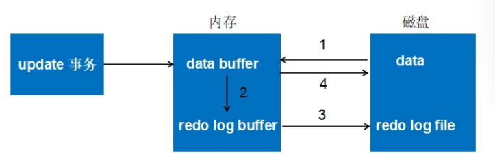

## 1. 引言

看数据库资料的时候，常常会看到事务、ACID、事务隔离级别、MVCC、锁这样概念，他们之间的关系是什么呢？引出这样几个问题：
>
>* 数据库的事务是什么，经常提到的ACID又是怎么回事？
>* ACID的每个特性是怎么实现的，不同事务隔离级别下，ACID特性实现的怎么样？
>* 事务和锁有什么关系，支持锁就是支持事务么？
>* 事务、ACID、隔离级别、锁等是怎么引申出来的？

## 2. 事务

### 2.1 概念

因为实际的应用场景而提出了事务的概念：你在设计一些任务的时候，需要多条SQL语句，并且希望这些语句要么全都执行，要不都不执行，如果最终结果是只执行了一半，就非常可能出现逻辑上的错误。可认为事务是访问和更新数据库的程序执行单元。

### 2.2 特征

有了基本概念上的认识，就要想想怎么才算事务呢，于是有了ACID特性，即
```
 * Atomicity.原子性: 一个事务的操作是要么全部成功，要么全部失败
 * Consistency.一致性: 事务执行结束后，数据库还是合法状态（就是你认为对的状态）
 * Isolation.隔离性: 一个事务的执行不受其他事务的影响。A、D侧重事务本身，I侧重事务之间
 * Durability.持久性: 事务执行完成了，不管接下来出现什么状况（宕机、断电），都可以保证后续使用的数据时事务操作后的数据
```
按照严格的标准，只有同时满足ACID特性才是事务。我们认为这是非常理想的情况，但是各个数据库厂家在实现时，很少真正满足ACID的全部特定；因此也就有观点认为，ACID是衡量事务的四个维度。
很多时候，事务与性能是相冲突的，事务越强，性能可能越低。

为了满足ACID特性，引出一些技术，包括我们常说的事务隔离级别、事务日志、锁等，具体来看

* 原子性： 采用undo日志，当事务执行出现问题（包括机器崩溃），通过undo日志的内容，将已经的执行的部分回滚。
* 一致性:  如果原子性、隔离性、持久性不能满足，一致性也就无法保证； 数据库完整性约束也一定程度保证一致性,包括：实体完整性（如行的主键存在且唯一）、列完整性（如字段的类型、大小、长度要符合要求）、 外键约束、 用户自定义完整性
* 隔离性: 一般采用锁机制来满足；当然也会在锁机制上做改进，比如MVCC。
* 一致性: 采用redo日志实现。

由此我们知道，为了实现ACID特性，使用了undo、redo日志（两者称为事务日志）、锁机制、MVCC。其实在隔离性上，SQL标准还定义了事务隔离级别 ；个人理解是根据实现难易、性能影响等定义的隔离级别。支持事务也就支持并发，这会引入新的问题，我们在最后讨论这些问题。

先理清这些概念关系，接下来我们介绍这些技术点。

## 3 事务日志

MySQL中会有多种日志，包括
```
* 错误日志：记录出错信息，也记录一些警告信息或者正确的信息。
* 查询日志：记录所有对数据库请求的信息，不论这些请求是否得到了正确的执行。
* 慢查询日志：设置一个阈值，将运行时间超过该值的所有SQL语句都记录到慢查询的日志文件中。
* 二进制日志：记录对数据库执行更改的所有操作。
* 中继日志：中继日志也是二进制日志，用来给slave 库恢复
* 事务日志：重做日志redo和回滚日志undo
```
此处我们主要介绍事务日志，并与二进制日志比较。接下来描述的时 **InnoDB**引擎实现方式：

### 3.1 redo log

**背景:** 数据在磁盘，每次读写数据执行IO，效率会很低，为此使用了缓存(Buffer Pool)。Buffer Pool包含磁盘中部分数据页的映射：当读取数据时，会首先从缓存中读取，若没有，则从磁盘读取后放缓存；当写数据时，先写入缓存，缓存修改的数据会定期刷新到磁盘中（这一过程称为刷脏）。带来问题：如果发生故障，缓存中修改的数据没有刷新到磁盘，会导致数据丢失。

**产生:** 引入redo log，当修改缓存数据时，还记录redo log，在事务提交（正式生效）之前，这些redo log将提前刷新到磁盘（连续空间）上持久化。redo log采用的是WAL（Write-ahead logging，预写式日志），所有修改先写入日志，再更新到缓存。

**使用：** 事务提交执行成功了，缓存中数据已经生效了，此时redo log中数据也已经记录在磁盘，后续会将缓存中数据刷到磁盘。如果在刷新过程出现问题（宕机、崩溃），重启后，可读取redo log中数据，恢复到崩溃前的之歌状态。这样保证了数据一致性。

**措施：** redo log 比直接写入数据磁盘有什么优势呢？1. redo log是连续空间，写入是追加操作，为顺序IO，操作更快；而刷脏是主要随机IO，速度慢。2. redo log 仅包含真正需要写入的部分，无效IO少，而刷脏以数据页（PAGE）为单元，一个page上只要有一个小改动，整个页都需要写入。

**执行流程：** Redo log可以简单分为以下两个部分：内存中重做日志缓冲 (redo log buffer)、重做日志文件 (redo log file) 。以一个更新事务为例，其流转过程如下图：
<div align=center></div>

    - 1. 先将原始数据从磁盘中读入内存中来，修改数据的内存拷贝
    - 2. 生成一条重做日志并写入redo log buffer，记录的是数据被修改后的值
    - 3. 当事务commit时，将redo log buffer中的内容刷新到 redo log file，对 redo log file采用追加写的方式
    - 4. 定期将内存中修改的数据刷新到磁盘中

**配置：** 当事务提交时，先将 redo log buffer 写入到 redo log file 进行持久化，待事务的commit操作完成时才算完成。通过参数 `innodb_flush_log_at_trx_commit` 控制 redo log刷新到磁盘的策略，具体如下：

    - 参数为1时，（默认为1），表示事务提交时必须调用一次 fsync 操作，最安全的配置，保障持久性
    - 参数为2时，则在事务提交时只做 write 操作，只保证将redo log buffer写到系统的页面缓存中，不进行fsync操作，因此如果MySQL数据库宕机时 不会丢失事务，但操作系统宕机则可能丢失事务
    - 参数为0时，表示事务提交时不进行写入redo log操作，这个操作仅在master thread 中完成，而在master thread中每1秒进行一次重做日志的fsync操作，因此实例 crash 最多丢失1秒钟内的事务。（master thread是负责将缓冲池中的数据异步刷新到磁盘，保证数据的一致性）

### 3.2 undo log
    
**产生：** 在事务执行过程，除了记录redo log 外，还记录undo log，它记录了数据在操作前的状态。

**使用：** 事务或语句执行失败了，或用户调用rollback，事务需要回滚，就可使用undo log 中信息将数据回滚到修改之前的样子。 
    
    - undo log 除了用于事务回滚，还会用于MVCC，所以在实现的时候（特别时delete、update的undo log）有很多MVCC上的考虑。        

**优化：**

* 为了满足事务的原子性，在操作任何数据之前，首先将数据备份到一个地方（这个存储数据备份的地方称为Undo Log）。
* 与redo log不同的是，磁盘上不存在**单独的**undo log文件，它存放在数据库内部的一个特殊段(segment)中，这称为undo段(undo segment)，undo段位于共享表空间内。磁盘上还是有undo日志的，只不过不是单独的。
* 采用逻辑日志，只是将数据库逻辑地恢复到原来的样子（是让数值等恢复原来样子，数据结构、页等可能已经发生了变化）。
* 对于insert语句，产生insert undo log；因对其他事务不可见，所以该undo log 可以在事务提交后直接删除。
* 通过undo log记录delete和update操作的结果：

    - delete操作实际上不会直接删除，而是将delete对象打上delete flag，标记为删除，最终的删除操作是purge线程完成的。
    - update分为两种情况：update的列是否是主键列。（update最终也是在purge线程完成）

        - 如果不是主键列，在undo log中直接反向记录是如何update的。即update是直接进行的。
        - 如果是主键列，update分两部执行：先删除该行，再插入一行目标行


### 3.3 redo & undo

假设有A、B两个数据，值分别为1,2，对两列数据执行update+1的事务操作，redo log 和 undo log 生成可以简化如下
```
    1. 事务开始
    2. 记录A=1到undo log
    3. 修改A=3
    4. 记录A=3到 redo log
    5. 记录B=2到 undo log
    6. 修改B=4
    7. 记录B=4到redo log
    8. 将redo log写入磁盘
    9. 事务提交
```

### 3.4 redo & binary 


**层次不同：** 一个在服务器层，一个在引擎层：
    
    二进制日志是在服务器层产生的，不管是什么存储引擎，对数据库进行了修改都会产生二进制日志。而redo log是innodb引擎层产生的，只记录该存储引擎中表的修改。并且二进制日志先于redo log被记录。

**内容不同：** 一个是逻辑日志，一个是物理日志：
    
    二进制日志记录操作的方法是逻辑性的语句。即便它是基于行格式的记录方式，其本质也还是逻辑的SQL设置，如该行记录的每列的值是多少。而redo log是在物理格式上的日志，它记录的是数据库中每个页的修改。

**记录时机不同：** 一个仅在事务提交时写入，一个记录则多元：

    二进制日志只在每次事务提交的时候一次性写入缓存中的日志"文件"(对于非事务表的操作，则是每次执行语句成功后就直接写入)。而redo log在数据准备修改前写入缓存中的redo log中，然后才对缓存中的数据执行修改操作；而且保证在发出事务提交指令时，先向缓存中的redo log写入日志，写入完成后才执行提交动作。

    因为二进制日志只在提交的时候一次性写入，所以二进制日志中的记录方式和提交顺序有关，且一次提交对应一次记录。而redo log中是记录的物理页的修改，redo log文件中同一个事务可能多次记录，最后一个提交的事务记录会覆盖所有未提交的事务记录。例如事务T1，可能在redo log中记录了 T1-1,T1-2,T1-3，T1* 共4个操作，其中 T1* 表示最后提交时的日志记录，所以对应的数据页最终状态是 T1* 对应的操作结果。而且redo log是并发写入的，不同事务之间的不同版本的记录会穿插写入到redo log文件中，例如可能redo log的记录方式如下： T1-1,T1-2,T2-1,T2-2,T2*,T1-3,T1* 。

**幂等性：** 是否具有幂等性：

    事务日志记录的是物理页的情况，它具有幂等性，因此记录日志的方式极其简练。幂等性的意思是多次操作前后状态是一样的，例如新插入一行后又删除该行，前后状态没有变化。而二进制日志记录的是所有影响数据的操作，记录的内容较多。例如插入一行记录一次，删除该行又记录一次。


## 锁


## 参考

1. [MySQL 技术内幕InnoDB存储引擎](https://book.douban.com/subject/24708143/)
2. [详细分析MySQL事务日志(redo log和undo log)](https://www.cnblogs.com/f-ck-need-u/p/9010872.html) 
3. [MYSQL事务的ACID--隔离级别的详解](https://blog.csdn.net/tangyuan_sibal/article/details/89538787)
